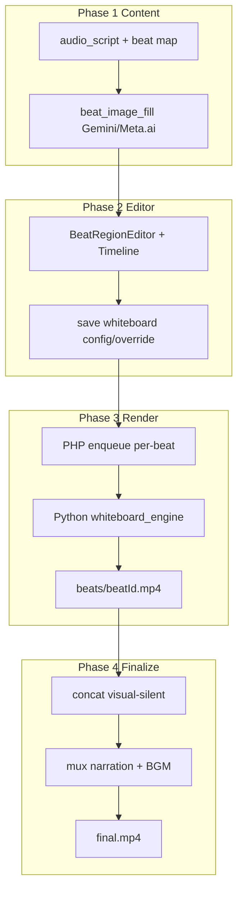

# Pipeline overview — Short Video Image (Whiteboard)

Mode **Image** (`agent_visual_mode=whiteboard`) dùng pipeline riêng, không qua HyperFrames.

---

## Sơ đồ end-to-end



---

## Phase 1 — Chuẩn bị nội dung

| Bước | Mô tả | File chính |
|------|--------|------------|
| Script + beat map | Chia narration thành beats, timing từ whisper | `agentVideoBeatDivisionWhiteboard.ts` |
| Sinh ảnh beat | Gemini Web / Meta.ai fill ảnh hybrid whiteboard | `gemini_web_beat_image_fill.php`, `metaai_beat_image_fill.php` |
| Chọn mode | `whiteboard` vs `hyperframes` | `agentVideoVisualMode.ts` |

Ảnh beat mặc định style **hybrid** (cutout photoreal + marker annotations trên nền trắng). Engine passthrough: không convert lineart, hiển thị ảnh gốc + tay vẽ/đưa vào vùng.

### Dual-layer beat image (2 ảnh mỗi beat)

Bước chia beat sinh `image_prompt` **7 key** — key thứ 7 `background_prompt` mô tả background plate **có trang trí** đúng chất liệu style (không phải nền trống). Khi gửi prompt sinh ảnh, engine tự chèn `output_images` (`WHITEBOARD_DUAL_LAYER_OUTPUT_RULE` / `marketing_short_video_agent_whiteboard_dual_layer_output_rule()`) buộc AI trả **đúng 2 ảnh**:

| Ảnh | Nội dung | Lưu vào |
|-----|----------|---------|
| IMAGE 1 | Object layer — subject + cluster vật thể + **3–6 label chữ**, nền trong suốt 100% (PNG alpha, cấm glow/haze/gradient/vignette), các cluster tách nhau bằng khoảng trống lớn | `import_html.beat_image[beatId].image_url` |
| IMAGE 2 | Background plate — chất liệu style + **motif trang trí ở 4 góc và dọc viền**, trung tâm low-contrast; cấm subject/chữ/số và cấm nền phẳng trống | beat override `custom_background_url` + `beat_image_over_background = true` |

Panel Duck.ai / Meta.ai đếm `Ảnh x/2`: chỉ POST `save-agent-import-html` (kèm `beat_background_image_url`) khi đủ 2/2; thiếu 1 ảnh = AI trả sai → nút **Làm lại beat** gửi lại prompt. Beat có `background_prompt` mà thiếu `custom_background_url` bị tính là **thiếu ảnh** (`missing_beat_image_ids`); beat-map cũ 6 key vẫn chỉ cần 1 ảnh.

Style suffix luôn kèm `WHITEBOARD_SEPARATED_LAYOUT_SUFFIX` (editorial infographic layout, independent object clusters, large negative space) — append sau style nên không đổi phong cách, chỉ tách vật thể để crop vùng chính xác.

---

## Phase 2 — Editor UI

| Component | Vai trò |
|-----------|---------|
| `ShortVideoAgentVideoWorkspace` | Shell workspace |
| `ShortVideoAgentBeatRegionEditor` | Canvas polygon, place/draw/erase, effects |
| `WhiteboardRegionTimeline` | Timeline kéo vùng + hiệu ứng zoom |
| `WhiteboardBeatTimingPreview` | Preview timing beat |
| `ShortVideoAgentImageAnimationControls` | Ken Burns per-beat (overlay trên box ảnh) |
| `beatTimelineEffects/*` | Registry + UI timeline zoom |
| `ShortVideoAgentWhiteboardBeatSettings` | duration/hold/color/transition per beat |

**Lưu cấu hình:**
- Clip-level → `saveAgentWhiteboardConfig` → `save-agent-whiteboard-config.php`
- Per-beat → `saveAgentWhiteboardBeatOverride` → `save-agent-whiteboard-beat-override.php`

---

## Phase 3 — Render từng beat

1. FE gọi `renderWhiteboardAgentBeat()` hoặc `renderWhiteboardAgentVideo()`
2. PHP hub `marketing-short-video-agent-whiteboard-helper.php`:
   - Resolve scene payload (timing, regions, transitions, `image_animation`, `timeline_effects`)
   - Enqueue job `image_to_whiteboard` (`job_kind=agent_whiteboard_beat_render`)
3. Queue worker `image_to_whiteboard.php` → gọi Python
4. Python `whiteboard_engine render` (CLI qua `marketing-image-to-whiteboard-helper.php`)
5. Finalize → copy/trim → `renders/beats/{beatId}.mp4`

**Thứ tự xử lý trong engine (`render.py`):**

```
1. render_frames (frames.py)     — compose vùng, place/draw effects, hands
2. apply_camera_motion           — Ken Burns (SKIP nếu có timeline zoom)
3. apply_timeline_effects        — zoom in/hold/out (trừ intro_sec)
4. encode_mp4 + SFX (encode.py)
5. _render_transition_out_clip   — transition sang beat kế (transitions.py)
```

Một file beat MP4 = **scene content** + **transition-out** (cuối beat, trừ beat cuối clip).

---

## Phase 4 — Ghép clip + mux audio

| Bước | Output |
|------|--------|
| Concat beats | `renders/visual-silent.mp4` |
| Mux narration + BGM + caption | `renders/final.mp4` (script `mux-whiteboard-agent-video.mjs`) |
| Upload (full-auto) | Store / agent video URL |

**Poll trạng thái:** `getWhiteboardBeatRenders()` → `get-whiteboard-beat-renders.php`  
**Stream preview:** `stream-whiteboard-agent-beat-video.php`

---

## Full-auto pipeline (whiteboard)

Steps riêng mode Image (ẩn các bước HyperFrames):

| Step key | Label UI |
|----------|----------|
| `beat_image_fill` | Ảnh beat (2 lớp: object layer + background plate) |
| `whiteboard_render` | Render ảnh beat |
| `whiteboard_mux` | Ghép video + audio |
| `upload` | Upload |

Ref: `agentVideoPipelineStepLabels.ts`, `marketing-short-video-full-auto-pipeline.php`

---

## Kiến trúc render agent vs legacy

- **Agent (hiện tại):** render **per-beat** → concat → mux. Mỗi beat độc lập, có transition-out ghép sẵn.
- **Legacy:** multi-scene 1 job — không dùng cho agent final.

---

## Output directory

```
storage/agent-renders/{shortVideoId}/my-video/renders/
├── beats/
│   ├── beat_1.mp4
│   └── beat_2.mp4
├── visual-silent.mp4
└── final.mp4
```
