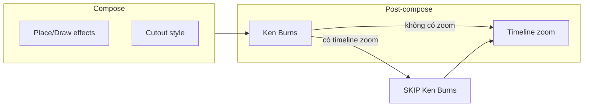

# Effects layers — Whiteboard beat

6 lớp hiệu ứng độc lập, áp dụng theo thứ tự render. Nguồn truth FE: `agentVideoApi.ts`; engine: `frames.py`, `camera_motion.py`, `timeline_effects.py`, `transitions.py`.

---

## Tổng quan 6 lớp

| # | Lớp | Field / config | Phạm vi | Engine |
|---|-----|----------------|---------|--------|
| 1 | Place effect | `place_effect` (action=place) | Sau khi đặt cutout | `frames.py` |
| 2 | Draw effect | `place_effect` (action=draw) | Sau khi vẽ tay xong | `frames.py` |
| 3 | Cutout style | `place_shadow`, `place_border`, … | Persistent suốt beat | `frames.py` |
| 4 | Ken Burns | `image_animation_effect` | Toàn frame beat | `camera_motion.py` |
| 5 | Timeline zoom | `timeline_effects[]` | Toàn frame, scene_budget | `timeline_effects.py` |
| 6 | Transition | `transition` | Giữa beats | `transitions.py` |

**Thứ tự render:** compose (1–3) → Ken Burns (4) → timeline (5) → encode SFX → transition-out (6)

---

## Lớp 1 — Place effects (`action=place`)

| Effect | Mô tả | Duration (s) |
|--------|-------|--------------|
| `loang` | Vệt phun + viền mực lan (mặc định) | 1.0 |
| `slide_friction` | Trượt quán tính + nảy | 0.35 |
| `zoom_out_bounce` | Thu nhỏ từ rất to + đàn hồi (không tay) | 0.6 |
| `pop_in_bounce` | Phóng to + nảy (không tay) | 0.6 |
| `mirror_sheen` | Quét sáng tráng gương | 0.4 |
| `neon_border` | Đèn neon chạy viền (+ SFX) | 1.2 |
| `none` | Không hiệu ứng | 0 |

**Thêm cho place:**
- `place_hand` — kiểu tay đưa ảnh (`ban_tay_dua_anh_vao`, `hand_move`, …)
- `place_entry_direction` — hướng đưa ảnh (top_down, left, …)
- `place_effect_color` — màu neon khi `neon_border`

Assets tay: `whiteboard/keo-anh/meta.json`

---

## Lớp 2 — Draw effects (`action=draw`)

Subset của place — cùng field `place_effect`:

| Effect | Mặc định |
|--------|----------|
| `none` | ✓ (chỉ vẽ tay) |
| `loang` | Vệt sau khi vẽ xong |
| `mirror_sheen` | Quét sáng |
| `neon_border` | Neon viền |

**Thêm cho draw:**
- `draw_hand` — id bút trong `whiteboard/pencil/meta.json` (mặc định `but_chi`)

---

## Lớp 3 — Cutout style (persistent)

Gắn cố định suốt beat — **không phải** animation tạm:

| Field | Mô tả |
|-------|-------|
| `place_shadow` | Bóng đổ (place: mặc định bật) |
| `place_border` + `place_border_color` | Viền màu quanh cutout |
| `place_torn_paper` | Viền giấy xé |

---

## Lớp 4 — Ken Burns (`image_animation_effect`)

Camera chậm trên **toàn frame** sau compose.

| Value | Mô tả |
|-------|--------|
| `none` | Tắt |
| `random` | Deck không trùng beat liền kề |
| `zoom_in` / `zoom_out` | Zoom nhẹ |
| `pan_left` / `pan_right` | Pan ngang |
| `tilt_up` / `tilt_down` | Pan dọc |
| `focus_pull` | Mờ → nét |
| `common` | Theo clip config (chỉ per-beat override) |

- Clip config: `agent_whiteboard_config.image_animation_effect`
- Per-beat: `AgentWhiteboardBeatOverride.image_animation_effect`
- UI: `ShortVideoAgentImageAnimationControls` (overlay trên box ảnh)

**Quy tắc:** Khi beat có `timeline_effects` type `zoom` → **tắt** Ken Burns (`render.py` skip `apply_camera_motion`).

Engine: `camera_motion.py` — **khác** Ken Burns GSAP trong HyperFrames skills.

---

## Lớp 5 — Timeline effects (`timeline_effects[]`)

Hiện tại chỉ **`type: 'zoom'`** — zoom in / hold / zoom out.

| Field | Ý nghĩa |
|-------|---------|
| `start_sec`, `end_sec` | Khoảng effect (scene_budget-relative) |
| `zoom_in_end_sec`, `hold_end_sec` | Ranh giới 3 phase |
| `zoom_level` | 1.0 – 2.0 |
| `focus_x`, `focus_y` | Điểm zoom (0–1, ratio ảnh gốc) |
| `layer` | Stack khi overlap — số lớn = áp sau |

FE registry: `beatTimelineEffects/`  
UI timeline: `WhiteboardRegionTimeline.tsx`  
Preview: `WhiteboardBeatTimingPreview.tsx`, `resolveZoomTransform.ts`

**Thêm loại mới:** đăng ký FE registry + implement trong `timeline_effects.py` (docstring có hướng dẫn).

---

## Lớp 6 — Transitions (giữa beats)

| ID | Ghi chú |
|----|---------|
| `camera_pan` | |
| `erase` | Mặc định engine |
| `slide` | |
| `ink_pop` | |
| `fade` | |
| `page_flip` | |
| `paper_tear` | |
| `paint_stroke` | |

Config UI: `random` | concrete id | `none`  
Duration mặc định: 1.2s (`TRANSITION_DURATION_SEC`)  
Catalog: DB → sync `whiteboard/next-screen/meta.json`  
Quản lý UI: `WhiteboardTransitionManagerDrawer.tsx`

Transition-out render cuối beat file, dùng animation beat kế (`transition_out_image_animation_effect`).

---

## Quy tắc chồng / tắt

1. **Timeline zoom thay thế Ken Burns** — không chồng hai lớp zoom camera
2. **Place SFX loang** fire tại `place_fix` (visual loang), không tại settle
3. **Timeline zoom** tính sau `intro_sec` — `start_sec=0` ≠ frame đầu file đã zoom
4. **Cutout style** persistent — không conflict với place/draw animation

---

## SFX (encode.py)

| SFX | Trigger |
|-----|---------|
| `loang.mp3` | Frame đầu place_fix (visual loang) |
| `settle` sounds | Chỉ ghi metadata, không fire SFX chính nếu có place_fix |
| `neon` | Gated theo effect neon_border |

Mix trong `encode.py` — fade out gần cuối scene nếu SFX dài hơn scene budget.
